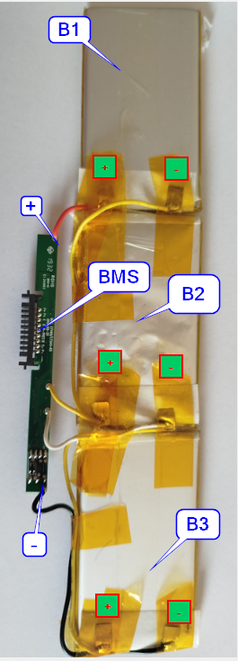
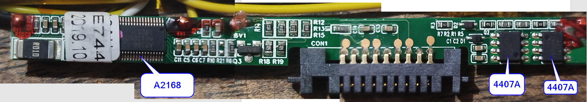
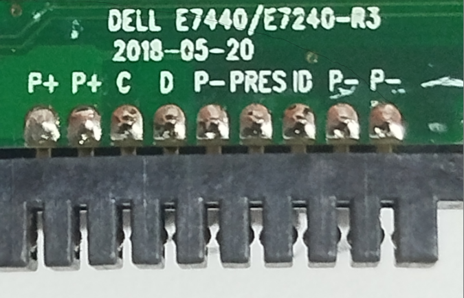
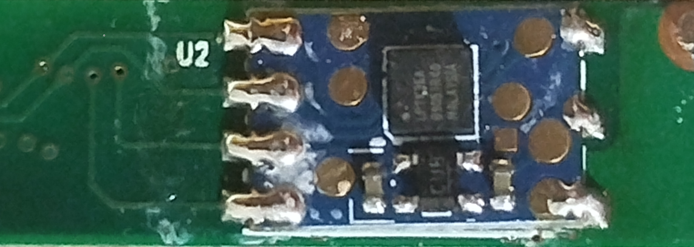
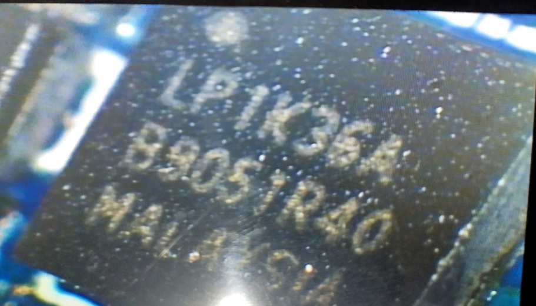
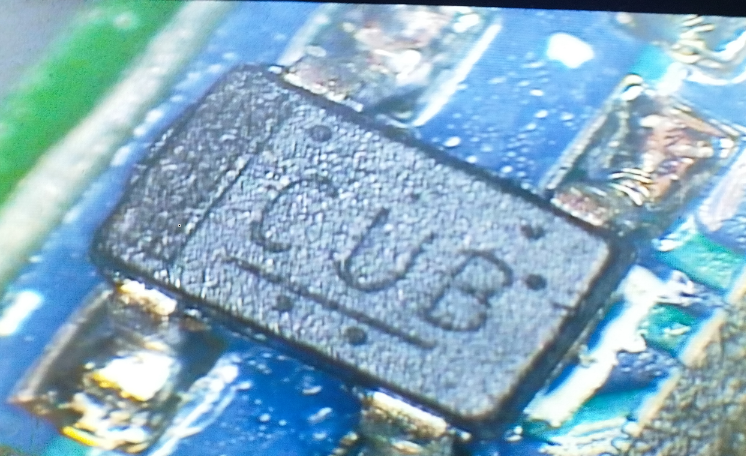
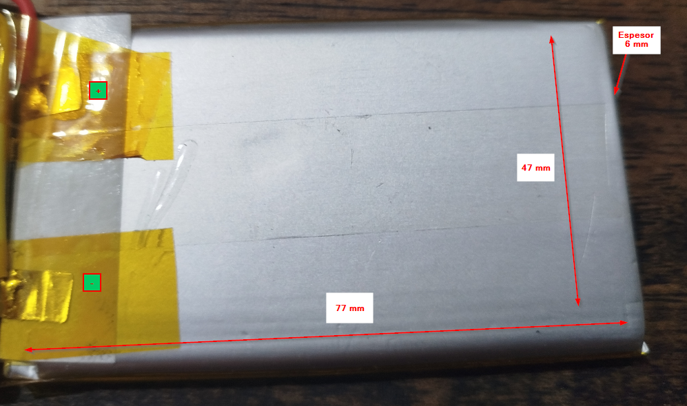

# Bateria-Dell-E7440-E7240-R3-2018-05-20
Documentacion completa del pack de bateria para intentar diagnosticar 

## Datos del pack

Tecnología: Li-ion
DC: 11.1 VDC
Potencia: 3200 mA/h  36 Wh

## Esquema del Circuito Global

## BMS

### IC A2168

El chip A2168 no es un chip original de Texas Instruments (como los BQ estándar de Dell), sino un clon de diseño chino muy común en las baterías de reemplazo genéricas o réplicas (no OEM)

A nivel de software y tramas, este integrado emula exactamente el comportamiento y el mapa de registros de un chip clásico: el BQ20Z45 o el BQ20857

### IC 4407A

MOSFETs de Canal P (AO4407A) de potencia. Su función exclusiva en este BMS es actuar como interruptores electrónicos (llaves de paso). Uno controla la línea de Carga y el otro la de Descarga

### IC LP1K36A

En la topología de diseño de este tipo de baterías clonadas o genéricas, el circuito se divide de forma muy clara:

1. El chip principal A2168 (lado A) procesa la lógica, cuenta los ciclos, mide la capacidad y gestiona el protocolo de datos SMBus hacia la laptop.
2. El chip secundario LP1K36A (lado B) se encarga del monitoreo analógico puro en tiempo real. Monitorea de manera directa el balance de los voltajes de cada celda y controla las compuertas físicas de los MOSFETs 4407A ante eventos críticos.

### IC CUB

Regulador de voltaje LDO (Low-Dropout) de ultra-bajo consumo continuo

## Bateria

